# Diagrama de Arquitectura - RIMAC Microfrontends

## 🏗️ Arquitectura General


## 🔄 Flujo de Usuario

```mermaid
sequenceDiagram
    participant U as Usuario
    participant S as mf-shell
    participant H as mf-home
    participant P as mf-planes
    participant R as mf-resumen
    participant API as APIs

    U->>S: Accede a la aplicación
    S->>H: Carga mf-home
    H->>API: Obtiene datos del usuario
    API-->>H: Retorna user.json
    U->>H: Completa formulario
    H->>S: Envía evento USER_DATA_UPDATED
    S->>P: Navega a mf-planes
    P->>API: Obtiene planes
    API-->>P: Retorna plans.json
    P->>P: Filtra planes por edad
    U->>P: Selecciona plan
    P->>S: Envía evento PLAN_SELECTED
    S->>R: Navega a mf-resumen
    R->>R: Muestra resumen completo
    U->>R: Confirma compra
```



## 🏛️ Estructura de Componentes


## 🔧 Configuración de Webpack Module Federation

```mermaid
graph LR
    subgraph "mf-shell (Host)"
        ShellConfig[ModuleFederationPlugin<br/>name: 'shell'<br/>remotes: mfHome, mfPlanes, mfResumen]
    end
    
    subgraph "mf-home (Remote)"
        HomeConfig[ModuleFederationPlugin<br/>name: 'mfHome'<br/>exposes: './App']
    end
    
    subgraph "mf-planes (Remote)"
        PlanesConfig[ModuleFederationPlugin<br/>name: 'mfPlanes'<br/>exposes: './App']
    end
    
    subgraph "mf-resumen (Remote)"
        ResumenConfig[ModuleFederationPlugin<br/>name: 'mfResumen'<br/>exposes: './App']
    end
    
    subgraph "shared (Library)"
        SharedConfig[Package<br/>@rimac/shared<br/>Types, Services, Utils]
    end
    
    ShellConfig -->|Consumes| HomeConfig
    ShellConfig -->|Consumes| PlanesConfig
    ShellConfig -->|Consumes| ResumenConfig
    
    HomeConfig -->|Imports| SharedConfig
    PlanesConfig -->|Imports| SharedConfig
    ResumenConfig -->|Imports| SharedConfig
```

## 📊 Estados y Comunicación


## 🎯 Tecnologías y Dependencias


## 🔒 Seguridad y Validación


Este diagrama muestra la arquitectura completa del sistema de microfrontends de RIMAC, incluyendo la comunicación entre módulos, el flujo de datos, y las tecnologías utilizadas.
