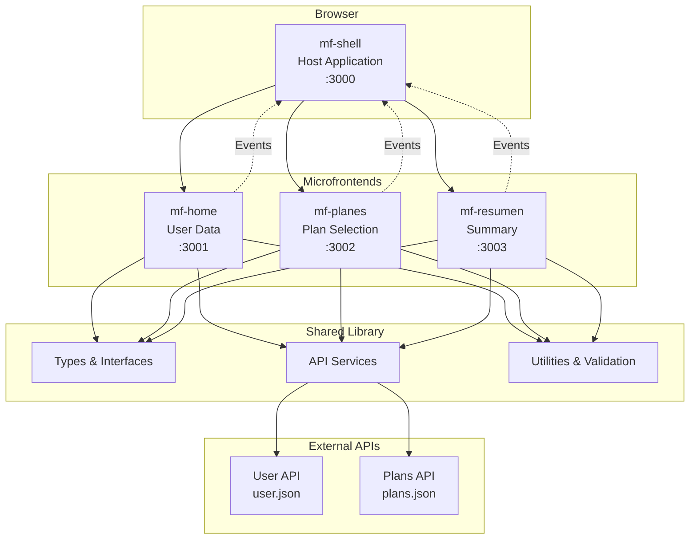

# Arquitectura del Sistema - RIMAC Microfrontends

## 🏗️ Diagrama de Arquitectura



## 🔄 Flujo de Comunicación

### 1. Inicialización
- El shell carga y orquesta los microfrontends
- Cada microfrontend se registra como un módulo remoto
- Se establece la comunicación via eventos personalizados

### 2. Navegación
- El shell maneja el routing principal
- Los microfrontends se cargan dinámicamente según la ruta
- El estado se comparte via eventos del DOM

### 3. Comunicación entre Microfrontends
```typescript
// Evento enviado desde microfrontend
const event: MicrofrontendEvent = {
  type: 'USER_DATA_UPDATED',
  payload: { user, userFormData }
};

window.dispatchEvent(new CustomEvent('microfrontend-event', { detail: event }));

// Evento escuchado en el shell
window.addEventListener('microfrontend-event', (event) => {
  const { type, payload } = event.detail;
  // Actualizar estado y navegar
});
```

## 📦 Estructura de Módulos

### mf-shell (Host)
- **Puerto**: 3000
- **Responsabilidad**: Orquestación y routing
- **Expone**: Nada (es el host)
- **Consume**: Todos los microfrontends

### mf-home (User Data)
- **Puerto**: 3001
- **Responsabilidad**: Captura de datos del usuario
- **Expone**: `./App` (UserForm component)
- **Consume**: `@rimac/shared`

### mf-planes (Plan Selection)
- **Puerto**: 3002
- **Responsabilidad**: Selección de planes
- **Expone**: `./App` (PlanSelection component)
- **Consume**: `@rimac/shared`

### mf-resumen (Summary)
- **Puerto**: 3003
- **Responsabilidad**: Resumen y confirmación
- **Expone**: `./App` (Summary component)
- **Consume**: `@rimac/shared`

### shared (Library)
- **Responsabilidad**: Tipos, servicios y utilidades compartidas
- **Expone**: Todo el módulo
- **Consume**: Nada (es una librería)

## 🔧 Configuración de Webpack Module Federation

### Host Configuration (mf-shell)
```javascript
new ModuleFederationPlugin({
  name: 'shell',
  remotes: {
    mfHome: 'mfHome@http://localhost:3001/remoteEntry.js',
    mfPlanes: 'mfPlanes@http://localhost:3002/remoteEntry.js',
    mfResumen: 'mfResumen@http://localhost:3003/remoteEntry.js',
  },
  shared: {
    react: { singleton: true },
    'react-dom': { singleton: true },
    'react-router-dom': { singleton: true }
  }
})
```

### Remote Configuration (mf-home, mf-planes, mf-resumen)
```javascript
new ModuleFederationPlugin({
  name: 'mfHome', // o mfPlanes, mfResumen
  filename: 'remoteEntry.js',
  exposes: {
    './App': './src/App'
  },
  shared: {
    react: { singleton: true },
    'react-dom': { singleton: true },
    'react-router-dom': { singleton: true }
  }
})
```

## 🎯 Patrones de Diseño Utilizados

### 1. Module Federation Pattern
- Separación de responsabilidades
- Despliegue independiente
- Reutilización de código

### 2. Event-Driven Architecture
- Comunicación desacoplada
- Escalabilidad
- Mantenibilidad

### 3. Shared Library Pattern
- DRY (Don't Repeat Yourself)
- Consistencia de tipos
- Centralización de lógica común

### 4. Container Pattern
- El shell actúa como contenedor
- Gestión centralizada del estado
- Navegación unificada

## 🚀 Ventajas de esta Arquitectura

### Escalabilidad
- Fácil agregar nuevos microfrontends
- Despliegue independiente
- Equipos de desarrollo independientes

### Mantenibilidad
- Código modular
- Responsabilidades claras
- Testing independiente

### Performance
- Lazy loading de microfrontends
- Caching independiente
- Optimización por módulo

### Developer Experience
- Hot reload por microfrontend
- Desarrollo independiente
- Debugging simplificado

## 🔒 Consideraciones de Seguridad

### 1. Content Security Policy (CSP)
```html
<meta http-equiv="Content-Security-Policy" 
      content="default-src 'self'; 
               script-src 'self' 'unsafe-inline' 'unsafe-eval'; 
               style-src 'self' 'unsafe-inline';">
```

### 2. CORS Configuration
```javascript
headers: {
  'Access-Control-Allow-Origin': '*',
  'Access-Control-Allow-Methods': 'GET, POST, PUT, DELETE',
  'Access-Control-Allow-Headers': 'Content-Type, Authorization'
}
```

### 3. Sanitización de Datos
- Validación en el cliente y servidor
- Escape de HTML
- Validación de tipos TypeScript

## 📊 Métricas y Monitoreo

### Performance
- Bundle size por microfrontend
- Tiempo de carga inicial
- Tiempo de navegación entre módulos

### Errores
- Error boundaries por microfrontend
- Logging centralizado
- Alertas en tiempo real

### Usuario
- Tiempo de interacción
- Tasa de conversión
- Errores de validación

## 🔄 Ciclo de Vida de un Microfrontend

1. **Desarrollo**: Desarrollo independiente con hot reload
2. **Testing**: Testing unitario e integración
3. **Build**: Construcción independiente
4. **Deploy**: Despliegue independiente
5. **Runtime**: Carga dinámica en el shell
6. **Update**: Actualización sin afectar otros módulos

## 🛠️ Herramientas de Desarrollo

### Build Tools
- Webpack 5 con Module Federation
- TypeScript para tipado
- Sass para estilos

### Development Tools
- React DevTools
- Webpack DevServer
- Hot Module Replacement

### Testing Tools
- Jest para unit tests
- React Testing Library
- Cypress para e2e tests

### Code Quality
- ESLint para linting
- Prettier para formateo
- Husky para git hooks
